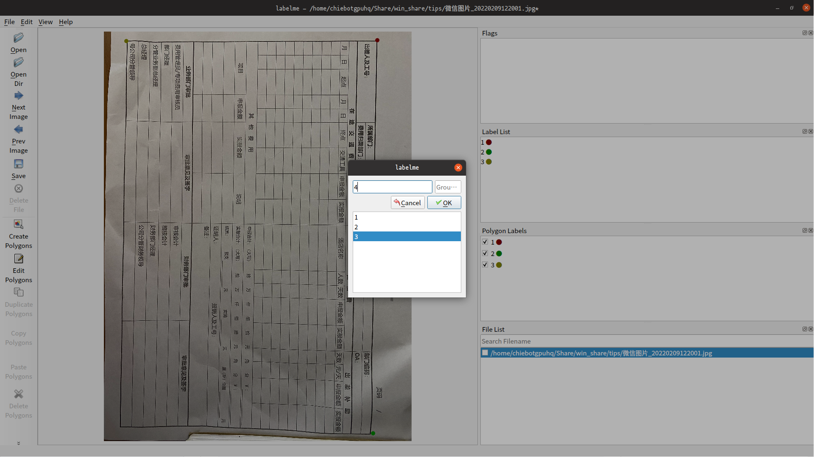

# Introduction
this repo just fork from <https://github.com/wkentaro/labelme> and add some personal function...

# 界面

# changelog
添加了和[自定义labelimg](https://github.com/cxy86121/labelimg_cxy)类似的临时记录功能和快捷标注功能.
